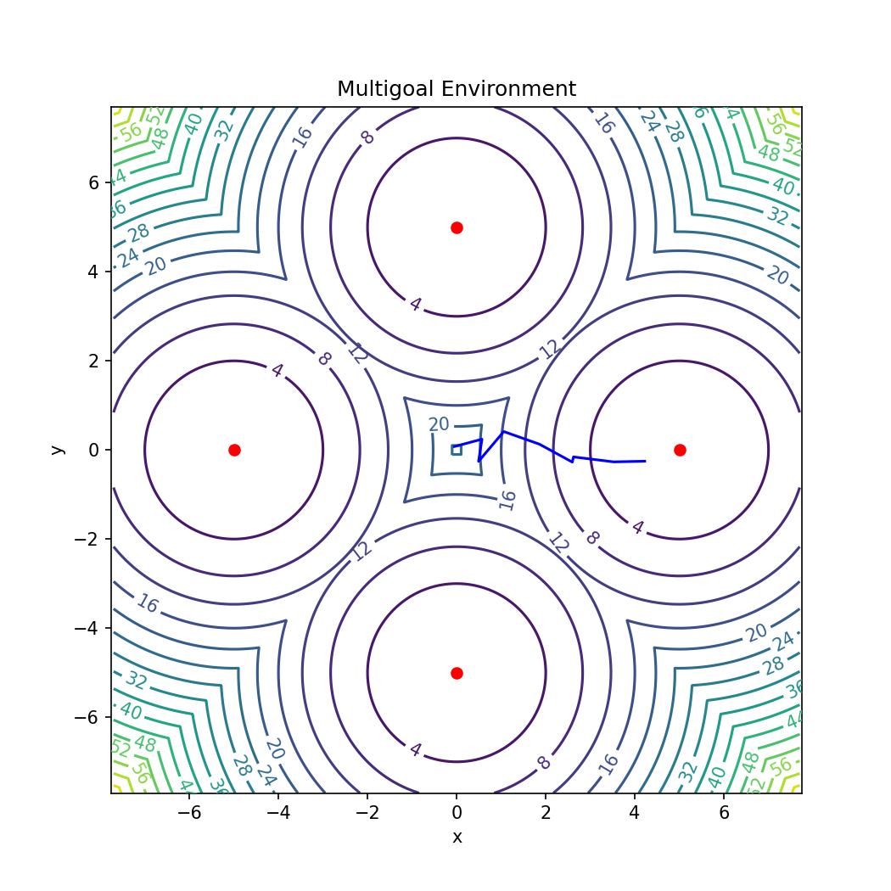

OpenAI-Gym porting of the Multi-Goal environment used in the paper *"Reinforcement Learning with Deep Energy-Based Policies" (Haarnoja et al., 2017)* [[arXiv]](https://arxiv.org/abs/1702.08165) [[GitHub]](https://github.com/haarnoja/softqlearning). The Multi-Goal environment is a bi-dimensional world, with continuous states, actions, and rewards. The agent (a particle) must reach one of the rewards. Typical algorithms fall into a local minimum and are not able to reach all the rewards. 

**Acknowledgments**: if you use this package, please acknowledge the original work of [Haarnoja et al. (2017)](https://arxiv.org/abs/1702.08165).

**Differences with original version**: the [original code](https://github.com/haarnoja/softqlearning) is not compatible with OpenAI-Gym. Therefore, the main difference is the removal of the calls to obsolete packages, which have been replaced with calls to [Gym](https://gym.openai.com/) classes. The package only requires `Numpy` and `Matplotlib`. Note that the method `render()` in this implementation is different from the original one. It is defined as `render(mode='png', file_path='./multigoal.png')` and it saves an image with the trajectory taken by the agent up to that point. Ideally it should be called at the end of the episode (see image). An additional parameter called `step_limit` has been defined at init time to avoid agents running indefinitely.

<p align="center">

</p>

**Example**: to test the code you can try this example based on a random agent

```python
import gym
env= gym.make('gym_multigoal:multigoal-v0', step_limit=500)
env.reset()
for _ in range(300):
    observation, reward, done, _ = env.step(env.action_space.sample()) # take a random action
    if(done): break
env.render(mode='png', file_path='./multigoal.png')
env.close()
```

License
-------

MIT License

Copyright (c) 2021 Massimiliano Patacchiola

Permission is hereby granted, free of charge, to any person obtaining a copy
of this software and associated documentation files (the "Software"), to deal
in the Software without restriction, including without limitation the rights
to use, copy, modify, merge, publish, distribute, sublicense, and/or sell
copies of the Software, and to permit persons to whom the Software is
furnished to do so, subject to the following conditions:

The above copyright notice and this permission notice shall be included in all
copies or substantial portions of the Software.

THE SOFTWARE IS PROVIDED "AS IS", WITHOUT WARRANTY OF ANY KIND, EXPRESS OR
IMPLIED, INCLUDING BUT NOT LIMITED TO THE WARRANTIES OF MERCHANTABILITY,
FITNESS FOR A PARTICULAR PURPOSE AND NONINFRINGEMENT. IN NO EVENT SHALL THE
AUTHORS OR COPYRIGHT HOLDERS BE LIABLE FOR ANY CLAIM, DAMAGES OR OTHER
LIABILITY, WHETHER IN AN ACTION OF CONTRACT, TORT OR OTHERWISE, ARISING FROM,
OUT OF OR IN CONNECTION WITH THE SOFTWARE OR THE USE OR OTHER DEALINGS IN THE
SOFTWARE.
